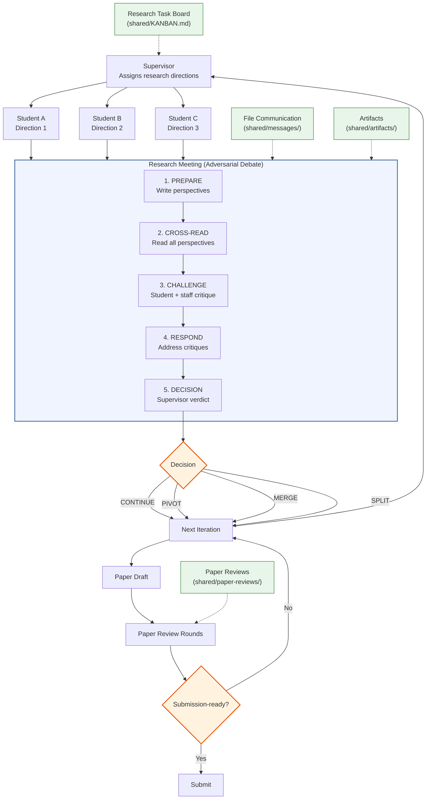

[English](README.md) | [中文](README_CN.md)

<div align="center">

<!-- Logo placeholder — replace with actual logo when available -->
<h1>Agora Lab</h1>

**Multi-Agent Research Orchestration for LLM Labs**

Adversarial lab meetings, paper-review workflows, a dashboard-first web workbench with an optional pixel-art Lab View, and auditable Markdown workflows.

`Claude / Codex / Copilot / Gemini · TypeScript · pnpm monorepo · Supervisor / Students / Research Staff / Paper Reviewers`

[](LICENSE)


[Quick Start](#quick-start) · [Web Dashboard](#web-dashboard) · [Tutorial](docs/tutorial.md) · [Examples](examples) · [Architecture](#architecture)

</div>

<p align="center">
  
</p>

## What is Agora Lab?

Agora Lab is a TypeScript framework for orchestrating supervisor, student, research-staff, and paper-reviewer LLM agents into an auditable AI research lab. Its core quality mechanism is a two-stage adversarial loop: structured research meetings refine directions through debate, then dedicated paper-review rounds gate submission readiness. Every interaction flows through Markdown files, a shared task board, and per-agent workspaces, so the research process stays inspectable from first literature survey to final paper.

The project is structured as a **pnpm monorepo** with four packages:

| Package | Description |
|---|---|
| `packages/core` | Core domain logic — kanban, meetings, agents, config, templates |
| `packages/cli` | `agora` CLI built with Commander.js — init, start, stop, agent/meeting/kanban subcommands |
| `packages/server` | WebSocket server — watches `.agora/` for file changes via chokidar, broadcasts events, handles client commands |
| `packages/web` | Dashboard-first web app — React panels for agents/kanban/messages plus a secondary Canvas-based Lab View |

## News

- **[2026-04-16]** Dashboard refresh — analyst workbench shell by default, with the original pixel lab preserved as a secondary Lab View
- **[2026-04-10]** Open-source launch — Agora Lab is now available publicly on GitHub

## Architecture



## Quick Start

The examples below assume the `agora` CLI is on your `PATH`. When running from a local clone, you can either link `packages/cli` globally yourself or replace `agora` with `node /path/to/agora-lab/packages/cli/dist/index.js`.

```bash
# 1. Clone and build
git clone https://github.com/LiXin97/agora-lab.git
cd agora-lab
pnpm install
pnpm build

# 2. Initialize a lab in any project directory
cd /path/to/your-project
agora init "Long Context Lab" -t "Efficient attention mechanisms for long-context LLMs"

# 3. Add agents (repeat as needed)
agora agent add student-a -r student
agora agent add student-b -r student
agora agent add research-staff -r research-staff
agora agent add paper-reviewer -r paper-reviewer

# 4. Bootstrap runtime state, launch agent tmux sessions, and start the watchdog
agora start
# agora start (a) seeds starter tasks once when the board is empty,
# (b) launches each configured agent in a dedicated tmux session, and
# (c) starts a runtime watchdog tmux session that automatically injects
#     kickoff and dispatch prompts into active agent sessions.
# Use `agora kanban assign` to dispatch an existing task to an agent.
# Human assignment remains the intentional control point for work dispatch.

# 5. Open the web dashboard
agora dev
```

This creates a `.agora/` directory in your project (like `git init` creates `.git/`):

```
your-project/
├── .agora/
│   ├── lab.yaml              # Lab config (git-committable)
│   ├── LAB.md                # Lab rules (git-committable)
│   ├── runtime.json          # Runtime bootstrap state (auto-managed)
│   ├── agents/               # Per-agent workspaces
│   │   ├── supervisor/
│   │   ├── student-a/
│   │   ├── staff-a/
│   │   └── paper-reviewer-1/
│   └── shared/               # Shared artifacts, messages, meetings, paper reviews
│       ├── KANBAN.md
│       ├── artifacts/
│       ├── meetings/
│       ├── paper-reviews/
│       └── messages/
└── .gitignore                # Auto-updated
```

### Web Dashboard

Launch the dashboard-first web UI:

```bash
agora dev      # development: websocket server + Vite frontend
agora web      # production-style: serves built frontend from packages/web/dist
```

Open the URL printed in the terminal. `agora dev` starts the realtime server on the requested port and a Vite frontend on a second local port.

<p align="center">
  
</p>

The default experience is an **Analyst Workbench**:

- **Left** — agent roster and status summary
- **Center** — kanban workbench for add / move / assign
- **Right** — recent messages and meeting controls
- **Bottom** — decision log and system health

A **top app chrome** sits above both views and provides:
- lab identity and connection health indicator
- **Dashboard / Lab View** tabs to switch the primary surface
- **System / Light / Dark** theme selector

**Interactive features:**

| Shortcut | Action |
|---|---|
| Dashboard | Add tasks, move status, assign agents, create / advance meetings, inspect decisions and health |
| Agent click (dashboard) | Focus tasks and messages for the selected agent |
| Chrome tab | Switch between Dashboard and Lab View |
| `K` or whiteboard (**Lab View**) | Open kanban overlay |
| `M` or meeting table (**Lab View**) | Open meeting overlay |
| Click agent (**Lab View**) | Open agent sidebar |
| Drag / scroll (**Lab View**) | Pan and zoom camera |
| Toolbar `R` (**Lab View**) | Reset camera to center |
| `Escape` | Close overlays and clear selection |

**Lab View** is a **low-motion monitoring surface** — agents occupy fixed positions and update their state (working / meeting / review) as the lab progresses, but continuous movement animation is not the normal experience. The canvas is no longer the primary control surface.

> **[Full Tutorial](docs/tutorial.md)** — End-to-end walkthrough with example agent outputs from a complete research session.
>
> **[Example Outputs](examples/)** — Browse sample artifacts, research-staff judgments, meetings, and paper-review rounds from a research session.

## How Does Agora Lab Compare?

| Capability | Agora Lab | MetaGPT | AutoGen | CrewAI | AI Scientist | Co-Scientist |
|---|:---:|:---:|:---:|:---:|:---:|:---:|
| **Adversarial N x N Review** | Structured cross-critique | -- | -- | -- | Self-review only | Elo ranking |
| **Meeting Protocol** | 5-phase structured | -- | Round-robin chat | -- | -- | Tournament |
| **Research Pipeline** | 7-step research loop + paper-review gate | SOP-driven workflows | Flexible chains | Task pipelines | End-to-end papers | Multi-step reasoning |
| **Multi-Backend** | Claude / Codex / Copilot / Gemini | OpenAI-centric | Multi-model | LLM-agnostic | OpenAI | Gemini |
| **Web Dashboard** | Dashboard-first workbench + pixel Lab View | -- | -- | -- | -- | Cloud UI |
| **Workspace Isolation** | Hook-enforced per-agent | Shared memory | Shared state | Shared state | Single agent | Cloud-managed |
| **File-Based Audit Trail** | Full Markdown trail | Code files | Logs | Logs | LaTeX outputs | Internal |
| **Stack** | TypeScript + React + Canvas 2D | Python | Python | Python | Python | Cloud service |
| **Role-Based Access** | Supervisor / Student / Staff / Reviewer RBAC | Role assignment | Agent roles | Role delegation | -- | -- |

## How It Works

```
Supervisor assigns research directions
         |
Students explore independently (tree search)
  |-- Student A: Direction 1
  |-- Student B: Direction 2
  +-- Student C: Direction 3
         |
Research Meeting (students + research staff)
  |-- PREPARE    -> students write perspectives, staff write judgments
  |-- CROSS-READ -> read perspectives + judgments
  |-- CHALLENGE  -> student cross-critique + staff critique
  |-- RESPOND    -> address critiques
  +-- DECISION   -> supervisor: continue / pivot / merge / split
         |
Next iteration (branches expand or converge)
         |
Student draft enters paper review
         |
Paper Review Case
  |-- R1 / R2 / ... by paper reviewers
  +-- supervisor resolves each round
         |
Submit or revise
```

## Roles

| Role | Responsibility | Backend + Persona |
|---|---|---|
| **Supervisor** | Assign directions, review progress, run research meetings, decide when work enters paper review | Any supported backend; defaults to Claude Code. Persona is a top-tier PI / lab builder profile. |
| **PhD Student** | Independent research: literature, hypothesis, experiments, paper drafting | Any supported backend; defaults to Claude Code. Persona is an elite fellowship-caliber researcher with an MBTI, background, and notable results. |
| **Research Staff** | Join regular research-loop meetings, stress-test scope/evidence/claims, provide lab-level scientific judgment | Any supported backend; defaults to Claude Code. Persona is a senior postdoc or junior faculty profile with strong mentoring and evaluation instincts. |
| **Paper Reviewer** | Run dedicated paper-review rounds focused on novelty, rigor, evidence, and submission readiness | Any supported backend; defaults to Claude Code. Persona is a top-tier critical evaluator with an explicit review lens and achievements. |

## Key Features

- **Dashboard-first web UI**: Analyst workbench for agents, kanban, meetings, recent messages, decisions, and system health
- **Secondary Lab View**: Keep the original pixel-art canvas for spatial exploration and overlays
- **Dynamic scaling**: Add any number of students, research staff, and paper reviewers at runtime
- **Multi-runtime**: Every role can run on Claude Code, Codex, Copilot, or Gemini
- **Persona diversity**: Each agent carries a visible MBTI, elite background, notable results, and a role-specific research lens
- **Adversarial research meetings**: 5-phase protocol with student cross-critique and research-staff judgment
- **Separate paper review gate**: Dedicated paper-review workflow for pre-submission review rounds
- **Tree search**: Multiple students explore different directions simultaneously; supervisor prunes/merges
- **File-based communication**: All agent interaction through structured Markdown files
- **Research task board**: Markdown-based task tracking with concurrency-safe file operations
- **Workspace isolation**: Hooks enforce per-agent workspace boundaries
- **Role templates (TS-native)**: `agora init` and `agora agent add` write per-agent `CLAUDE.md` prompts from TypeScript-era Markdown templates — no shell stubs; each template includes a session-start checklist and current CLI commands
- **Bidirectional WebSocket**: Browser sends commands (kanban, meeting) to server; server watches files and broadcasts updates

## Group Meeting Protocol

Meetings are the core adversarial mechanism for the regular research loop — modeled after real lab group meetings:

1. **PREPARE**: Students write perspectives in `perspectives/`; research staff write judgments in `judgments/`
2. **CROSS-READ**: Everyone reads all perspectives, then acknowledges completion
3. **CHALLENGE**: Students critique each other (N x N), while research staff apply broader scientific judgment to scope, evidence, and positioning
4. **RESPOND**: Each participant addresses critiques targeting their work
5. **DECISION**: Supervisor reads everything and decides: `CONTINUE` | `PIVOT` | `MERGE` | `SPLIT`

Paper reviewers do **not** participate in these regular meetings; they operate through the paper-review workflow below.

## Paper Review Workflow

Paper-review artifacts live under `shared/paper-reviews/`, and the example snapshot in `examples/` shows the intended packet / round structure.

The current TypeScript CLI focuses on **lab initialization, agent management, kanban, meetings, and the web UI**. A dedicated `paper-review` subcommand is **not yet surfaced** in this rewrite, so paper-review case management is presently file/workflow driven.

Use the same directory conventions when modeling a review cycle:

1. Create a case directory under `shared/paper-reviews/<case-id>/`
2. Store per-round reviewer outputs under `rounds/Rn/reviews/`
3. Write the supervisor synthesis in `supervisor-resolution.md`
4. Repeat rounds until the draft is submission-ready

Each case keeps a durable packet, round history, assigned reviewers, and final status.

## Research Pipeline

Each student follows a 7-step pipeline:

1. **Literature survey** -> `.agora/shared/artifacts/{name}/literature_{topic}.md`
2. **Hypothesis** -> `.agora/shared/artifacts/{name}/hypothesis_{id}.md`
3. **Experiment design** -> `.agora/shared/artifacts/{name}/experiment_plan_{id}.md`
4. **Implementation** -> `.agora/agents/{name}/workspace/` (private)
5. **Execution** -> Run experiments in workspace
6. **Analysis** -> `.agora/shared/artifacts/{name}/experiment_results_{id}.md`
7. **Paper writing** -> `.agora/shared/artifacts/{name}/paper_draft_{version}.md`

## Commands Reference

```bash
# Core commands
agora init [name] -t <topic>                        # Non-interactive init when topic is provided; otherwise prompts
agora start                                         # Seed starter tasks (once), launch agent tmux sessions, start runtime watchdog
agora stop                                          # Stop every tmux session owned by this lab: agents, runtime watchdog, and any stale orphans
agora status                                        # Show lab status (agent states: offline/ready/assigned/working/meeting/review; kanban: todo/assigned/in_progress/review/done)
agora dev [-p port]                                 # WebSocket server + Vite dev server
agora web [-p port]                                 # Serve the built frontend from packages/web/dist

# Agent management
agora agent add <name> -r <role>                    # Add agent (supervisor|student|research-staff|paper-reviewer)
agora agent remove <name>                           # Remove agent
agora agent list                                    # List all agents

# Meeting management
agora meeting new                                   # Create a new meeting
agora meeting status [id]                           # Show meeting status
agora meeting advance <id>                          # Advance meeting phase

# Kanban board
agora kanban list                                   # List all tasks
agora kanban add -T <title> [-p P0-P3] [-a agent]  # Add a task
agora kanban assign -i <id> -a <agent>              # Assign an existing task to an agent (todo → assigned)
agora kanban move -i <id> -s <status>               # Move task (todo|assigned|in_progress|review|done)
```

## Project Structure

```
agora-lab/
├── packages/
│   ├── core/           # Domain logic (kanban, meetings, agents, config)
│   ├── cli/            # agora CLI (Commander.js)
│   ├── server/         # WebSocket server (chokidar file watcher + WS)
│   └── web/            # Dashboard-first web UI + secondary Lab View
│       └── src/engine/ # Tile map, sprites, pathfinding, layout, renderer
├── scripts/            # Legacy shell helpers retained for compatibility/reference
├── hooks/              # Claude Code hooks (workspace-guard, kanban-guard)
├── templates/          # Agent persona templates
├── skills/             # Role-specific skill definitions
└── examples/           # Sample lab outputs
```

## Requirements

- **Node.js 18+**
- **pnpm 8+**
- tmux (for agent session management)
- One or more of: [Claude Code](https://claude.ai/code), [Codex CLI](https://github.com/openai/codex), [Copilot CLI](https://docs.github.com/copilot), [Gemini CLI](https://github.com/google-gemini/gemini-cli)

## Development

```bash
git clone https://github.com/LiXin97/agora-lab.git
cd agora-lab
pnpm install
pnpm build        # Build all packages
pnpm test         # Run all tests (vitest)
pnpm lint         # Type-check (tsc --noEmit)
```

## Contributing

We welcome contributions! Please read our [Contributing Guide](CONTRIBUTING.md) and [Code of Conduct](CODE_OF_CONDUCT.md) before getting started.

## Community

- [GitHub Discussions](https://github.com/LiXin97/agora-lab/discussions) — Questions & ideas
- [GitHub Issues](https://github.com/LiXin97/agora-lab/issues) — Bug reports & feature requests

## Citation

If you use Agora Lab in your research, please cite:

```bibtex
@misc{agoralab2026,
  title={Agora Lab: Adversarial Multi-Agent Research Orchestration},
  author={Agora Lab Contributors},
  year={2026},
  url={https://github.com/LiXin97/agora-lab}
}
```

## License

[Apache 2.0](LICENSE)
