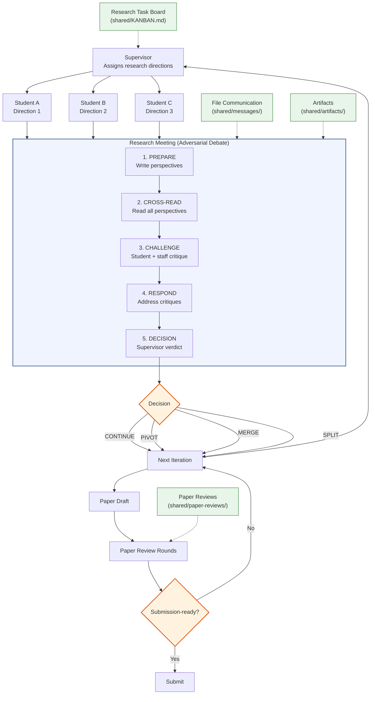

[English](README.md) | [中文](README_CN.md)

<div align="center">

<!-- Logo placeholder — replace with actual logo when available -->
<h1>Agora Lab</h1>

**Shell-Native Multi-Agent Research Automation for LLM Labs**

Adversarial lab meetings, paper-review rounds, auditable Markdown workflows, and workspace isolation.

`Claude / Codex / Copilot / Gemini · Bash CLI · Supervisor / Students / Research Staff / Paper Reviewers`

[](LICENSE)


[Quick Start](#quick-start) · [Tutorial](docs/tutorial.md) · [Examples](examples) · [Architecture](#architecture)

</div>

<p align="center">
  
</p>

## What is Agora Lab?

Agora Lab is a shell-native framework for orchestrating supervisor, student, research-staff, and paper-reviewer LLM agents into an auditable AI research lab. Its core quality mechanism is a two-stage adversarial loop: structured research meetings refine directions through debate, then dedicated paper-review rounds gate submission readiness. Every interaction flows through Markdown files, a shared task board, and per-agent workspaces, so the research process stays inspectable from first literature survey to final paper.

## News

- **[2026-04-10]** Open-source launch — Agora Lab is now available publicly on GitHub

## Architecture



## Quick Start

```bash
# 1. Install (one-time, installs to ~/.agora/)
curl -fsSL https://raw.githubusercontent.com/LiXin97/agora-lab/main/install.sh | bash

# 2. Initialize a lab in any project directory
cd your-project
agora init "Efficient attention mechanisms for long-context LLMs" --students 2 --staff 1 --paper-reviewers 1

# 3. Launch all agents + watchdog
agora start

# 4. Check the dashboard
agora status
```

This creates a `.agora/` directory in your project (like `git init` creates `.git/`):

```
your-project/
├── .agora/
│   ├── lab.yaml              # Lab config (git-committable)
│   ├── LAB.md                # Lab rules (git-committable)
│   ├── agents/               # Per-agent workspaces (gitignored)
│   │   ├── supervisor/
│   │   ├── student-a/
│   │   ├── staff-a/
│   │   └── paper-reviewer-1/
│   ├── shared/               # Shared artifacts, messages, meetings, paper reviews (gitignored)
│   ├── scripts → ~/.agora/scripts  # Symlink to global install
│   ├── hooks → ~/.agora/hooks     # Symlink to global install
│   ├── templates → ~/.agora/templates  # Symlink to global install
│   └── skills → ~/.agora/skills       # Symlink to global install
└── .gitignore                # Auto-updated
```

Or build the same lab manually with the underlying scripts:

```bash
AGORA_PROJECT_DIR="$PWD/.agora" bash ~/.agora/scripts/lab-init.sh --topic "Efficient attention mechanisms for long-context LLMs"
AGORA_PROJECT_DIR="$PWD/.agora" bash ~/.agora/scripts/lab-agent.sh -add -name student-a -role student -direction "linear attention"
AGORA_PROJECT_DIR="$PWD/.agora" bash ~/.agora/scripts/lab-agent.sh -add -name student-b -role student -direction "sparse attention"
AGORA_PROJECT_DIR="$PWD/.agora" bash ~/.agora/scripts/lab-agent.sh -add -name staff-a -role research-staff
AGORA_PROJECT_DIR="$PWD/.agora" bash ~/.agora/scripts/lab-agent.sh -add -name paper-reviewer-1 -role paper-reviewer
AGORA_PROJECT_DIR="$PWD/.agora" bash ~/.agora/scripts/lab-agent.sh -init-all
AGORA_PROJECT_DIR="$PWD/.agora" bash ~/.agora/scripts/lab-meeting.sh -caller supervisor -new
AGORA_PROJECT_DIR="$PWD/.agora" bash ~/.agora/scripts/lab-paper-review.sh -new draft-long-context-v1 student-a "paper-reviewer-1"
```

### Docker Quickstart

```bash
docker build -t agora-lab .
docker run -it --rm \
  -e AGORA_COPY_FRAMEWORK=1 \
  -e AGORA_PROJECT_DIR=/workspace/.agora \
  -v "$(pwd):/workspace" \
  -w /workspace \
  agora-lab bash /opt/agora-lab/scripts/lab-init.sh \
    --topic "Efficient attention mechanisms for long-context LLMs" \
    --students 2 --staff 1 --paper-reviewers 1
```

> The Docker image is an **init-only helper** for creating `.agora/` state on the host.
> It copies the required runtime files (`scripts/`, `hooks/`, `templates/`, and `skills/`) into the host project so the generated lab does not depend on container-only paths.
> To use an installed global `agora` CLI against that copied runtime, point it there explicitly: `AGORA_HOME="$PWD/.agora" agora status`.
> Run agent backends on the host (or in a separately provisioned container) after initialization.

> **[Full Tutorial](docs/tutorial.md)** — End-to-end walkthrough with example agent outputs from a complete research session.
>
> **[Example Outputs](examples/)** — Browse sample artifacts, research-staff judgments, meetings, and paper-review rounds from a research session.

## How Does Agora Lab Compare?

| Capability | Agora Lab | MetaGPT | AutoGen | CrewAI | AI Scientist | Co-Scientist |
|---|:---:|:---:|:---:|:---:|:---:|:---:|
| **Adversarial N x N Review** | Structured cross-critique | -- | -- | -- | Self-review only | Elo ranking |
| **Meeting Protocol** | 5-phase structured | -- | Round-robin chat | -- | -- | Tournament |
| **Research Pipeline** | 7-step research loop + paper-review gate | SOP-driven workflows | Flexible chains | Task pipelines | End-to-end papers | Multi-step reasoning |
| **Multi-Backend** | Claude / Codex / Copilot / Gemini | OpenAI-centric | Multi-model | LLM-agnostic | OpenAI | Gemini |
| **Workspace Isolation** | Hook-enforced per-agent | Shared memory | Shared state | Shared state | Single agent | Cloud-managed |
| **File-Based Audit Trail** | Full Markdown trail | Code files | Logs | Logs | LaTeX outputs | Internal |
| **Shell-Native** | Pure Bash (no Python core) | Python | Python | Python | Python | Cloud service |
| **Role-Based Access** | Supervisor / Student / Research Staff / Paper Reviewer RBAC | Role assignment | Agent roles | Role delegation | -- | -- |

Each framework has strengths: MetaGPT excels at SOP-driven software workflows; AutoGen provides flexible multi-modal agent conversations; CrewAI offers a simple, clean API for agent orchestration; AI Scientist produces end-to-end research papers autonomously; Co-Scientist uses Elo-based tournament ranking for idea selection. Agora Lab's differentiator is **adversarial structure** — the research loop forces student ideas through structured staff criticism, and the paper-review loop adds an explicit pre-submission gate for novelty, evidence, and claim discipline.

## How It Works

```
Supervisor assigns research directions
         |
Students explore independently (tree search)
  |-- Student A: Direction 1
  |-- Student B: Direction 2
  +-- Student C: Direction 3
         |
Research Meeting (students + research staff)
  |-- PREPARE    -> students write perspectives, staff write judgments
  |-- CROSS-READ -> read perspectives + judgments
  |-- CHALLENGE  -> student cross-critique + staff critique
  |-- RESPOND    -> address critiques
  +-- DECISION   -> supervisor: continue / pivot / merge / split
         |
Next iteration (branches expand or converge)
         |
Student draft enters paper review
         |
Paper Review Case
  |-- R1 / R2 / ... by paper reviewers
  +-- supervisor resolves each round
         |
Submit or revise
```

## Roles

| Role | Responsibility | Backend + Persona |
|---|---|---|
| **Supervisor** | Assign directions, review progress, run research meetings, decide when work enters paper review | Any supported backend; defaults to Claude Code. Persona is a top-tier PI / lab builder profile. |
| **PhD Student** | Independent research: literature, hypothesis, experiments, paper drafting | Any supported backend; defaults to Claude Code. Persona is an elite fellowship-caliber researcher with an MBTI, background, and notable results. |
| **Research Staff** | Join regular research-loop meetings, stress-test scope/evidence/claims, provide lab-level scientific judgment | Any supported backend; defaults to Claude Code. Persona is a senior postdoc or junior faculty profile with strong mentoring and evaluation instincts. |
| **Paper Reviewer** | Run dedicated paper-review rounds focused on novelty, rigor, evidence, and submission readiness | Any supported backend; defaults to Claude Code. Persona is a top-tier critical evaluator with an explicit review lens and achievements. |

## Skill Architecture

The lab uses a layered skill system:

- **Shared reference docs** available to all roles
- **Shared core workflow skills** (research task board, meetings, handoff)
- **Role-specific overlay skills** tailored to each role's responsibilities

Supervisor, student, research-staff, and paper-reviewer workspaces load different workflow skills by default. The generated role skill stacks in `lab.yaml` are the canonical source of truth.

## Key Features

- **Dynamic scaling**: Add any number of students, research staff, and paper reviewers at runtime
- **Multi-runtime**: Every role can run on Claude Code, Codex, Copilot, or Gemini; Codex/Copilot/Gemini remain explicit unsafe opt-in
- **Persona diversity**: Each agent carries a visible MBTI, elite background, notable results, and a role-specific research lens
- **Adversarial research meetings**: 5-phase protocol with student cross-critique and research-staff judgment
- **Separate paper review gate**: Dedicated `lab-paper-review.sh` workflow for pre-submission review rounds
- **Richer meeting context**: Agenda and status surfaces show participant backend and persona summaries before discussion starts
- **Tree search**: Multiple students explore different directions simultaneously; supervisor prunes/merges
- **File-based communication**: All agent interaction through structured Markdown files
- **Research task board**: Markdown-based task tracking with flock locking for concurrency
- **Workspace isolation**: Hooks enforce per-agent workspace boundaries
- **Role-based access control**: Launched agents bind runtime identity on Research task board and meeting operations
- **Skill library**: Shared, role-based skills symlinked into each agent
- **Session persistence**: Per-agent `memory.md` for cross-session context

## Group Meeting Protocol

Meetings are the core adversarial mechanism for the regular research loop — modeled after real lab group meetings:

1. **PREPARE**: Students write perspectives in `perspectives/`; research staff write judgments in `judgments/`
2. **CROSS-READ**: Everyone reads all perspectives, then acknowledges completion with `lab-meeting.sh -caller <name> -ack-read`
3. **CHALLENGE**: Students critique each other (N x N), while research staff apply broader scientific judgment to scope, evidence, and positioning
4. **RESPOND**: Each participant addresses critiques targeting their work
5. **DECISION**: Supervisor reads everything and decides: `CONTINUE` | `PIVOT` | `MERGE` | `SPLIT`

Paper reviewers do **not** participate in these regular meetings; they operate through the paper-review workflow below.

## Paper Review Workflow

Once a student has a paper draft worth external scrutiny, open a paper-review case:

1. **Open a case**: `lab-paper-review.sh -new <paper-id> <owner> <reviewers>`
2. **Collect round artifacts** under `shared/paper-reviews/<case-id>/rounds/Rn/`
3. **After all assigned reviews are present, write the supervisor resolution** in `supervisor-resolution.md`
4. **Complete the round** with `lab-paper-review.sh -complete-round <case-id>`
5. If the decision is not submission-ready, **open the next round** with `lab-paper-review.sh -round <case-id>`

Each case keeps a durable packet, round history, assigned reviewers, and final status.

## Research Pipeline

Each student follows a 7-step pipeline:

1. **Literature survey** -> `.agora/shared/artifacts/{name}/literature_{topic}.md`
2. **Hypothesis** -> `.agora/shared/artifacts/{name}/hypothesis_{id}.md`
3. **Experiment design** -> `.agora/shared/artifacts/{name}/experiment_plan_{id}.md`
4. **Implementation** -> `.agora/agents/{name}/workspace/` (private)
5. **Execution** -> Run experiments in workspace
6. **Analysis** -> `.agora/shared/artifacts/{name}/experiment_results_{id}.md`
7. **Paper writing** -> `.agora/shared/artifacts/{name}/paper_draft_{version}.md`

## Commands Reference

```bash
# Unified CLI (recommended)
agora init "topic" [--students N] [--staff N] [--paper-reviewers N]  # Initialize lab in current dir
agora start                                         # Launch agents + watchdog
agora stop                                          # Stop all agent sessions
agora status                                        # Dashboard overview
agora list                                          # Compact agent status table
agora watch                                         # Live dashboard (auto-refresh)
agora meeting                                       # Run meeting interactively
agora attach <name>                                 # Attach to agent's tmux
agora log                                           # Meeting history + completions

# Agent management (advanced)
lab-agent.sh -add -name <n> -role <role> [-backend <cli>] [-model <m>] [-direction "..."]
             [-preset <id>] [-mbti <type>] [-background "..."] [-results "..."]
lab-agent.sh -remove -name <n>
lab-agent.sh -init -name <n>          # Launch in tmux
lab-agent.sh -init-all                # Launch all
lab-agent.sh -list                    # Show all agents
lab-agent.sh -wake -name <n>          # Resume crashed session
lab-agent.sh -send -name <n> -from <sender> -message "..."
# valid roles: supervisor | student | research-staff | paper-reviewer

# Research task board (all operations require -caller <name>)
lab-kanban.sh -caller <name> -new -title "..." -assign <agent> -priority <P0-P3>
lab-kanban.sh -caller <name> -start -id <ID>
lab-kanban.sh -caller <name> -submit -id <ID> -artifacts "path1,path2"
lab-kanban.sh -caller <name> -approve -id <ID>
lab-kanban.sh -caller <name> -reject -id <ID> -reason "..."
lab-kanban.sh -caller <name> -done -id <ID> -summary "..."
lab-kanban.sh -caller <name> -status

# Research meetings (all operations require -caller <name>; only supervisor can create/advance/complete)
lab-meeting.sh -caller supervisor -new       # Create regular research-loop meeting
lab-meeting.sh -caller <name> -phase <name>  # Advance phase
lab-meeting.sh -caller <name> -ack-read      # Record CROSS-READ completion
lab-meeting.sh -caller <name> -complete      # Mark meeting completed
lab-meeting.sh -caller <name> -auto          # Run all phases interactively
lab-meeting.sh -caller <name> -status        # Show current meeting

# Paper review cases
lab-paper-review.sh -new <paper-id> <owner> "paper-reviewer-1 paper-reviewer-2"
lab-paper-review.sh -new paper-001 student-a "paper-reviewer-1"
lab-paper-review.sh -round <case-id>
lab-paper-review.sh -complete-round <case-id>
lab-paper-review.sh -status
```

## Security Model

Agora Lab uses a layered defense for multi-agent isolation:

1. **Runtime-bound caller identity**: Launched agents export their bound identity into the tmux session, and `lab-kanban.sh` / `lab-meeting.sh` reject mismatched callers
2. **Claude Code hooks**: `workspace-guard.sh` (PreToolUse) restricts writes to role-appropriate files; `kanban-guard.sh` (PostToolUse) validates Research task board format in `KANBAN.md`
3. **Permission patterns**: `settings.json` restricts which Bash commands, Read/Write/Edit paths each agent can access
4. **Safe defaults**: New labs default every role to a safe backend choice, and unsandboxed Codex/Copilot launches are disabled unless `security.allow_unsafe_backends: true`

**Known limitation**: If you explicitly enable unsafe backends, Codex/Copilot still launch as plain CLI processes in tmux. They remain outside Claude's hook/permission enforcement, so only opt in when you accept that loss of isolation or provide your own container sandbox.

**Execution note**: The safe default Claude student template no longer allows arbitrary `python` / `pip` shell commands. For local experiment execution, use a separately sandboxed runner or explicitly opt into an unsafe backend.

**Persona note**: New agents persist `persona_preset`, `mbti`, `background`, and `notable_results` in `lab.yaml`. If an older agent entry lacks those fields, status views, template rendering, and meetings derive a stable default persona from the role-specific preset catalog under `templates/personas/`.

## Requirements

- Bash 4.0+
- tmux
- jq or python3 (for secure hook JSON parsing)
- One or more of: [Claude Code](https://claude.ai/code), [Codex CLI](https://github.com/openai/codex), [Copilot CLI](https://docs.github.com/copilot), [Gemini CLI](https://github.com/google-gemini/gemini-cli)
- `flock` (standard on Linux, `brew install flock` on macOS)

## Contributing

We welcome contributions! Please read our [Contributing Guide](CONTRIBUTING.md) and [Code of Conduct](CODE_OF_CONDUCT.md) before getting started.

## Community

- [GitHub Discussions](https://github.com/LiXin97/agora-lab/discussions) — Questions & ideas
- [GitHub Issues](https://github.com/LiXin97/agora-lab/issues) — Bug reports & feature requests

## Citation

If you use Agora Lab in your research, please cite:

```bibtex
@misc{agoralab2026,
  title={Agora Lab: Adversarial Multi-Agent Research Orchestration},
  author={Agora Lab Contributors},
  year={2026},
  url={https://github.com/LiXin97/agora-lab}
}
```

## License

[Apache 2.0](LICENSE)
