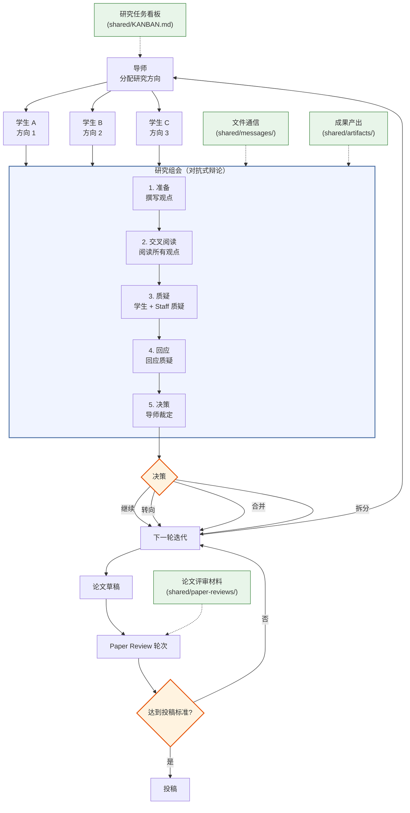

[English](README.md) | [中文](README_CN.md)

<div align="center">

<!-- Logo 占位符 — 有正式 Logo 后替换 -->
<h1>Agora Lab</h1>

**面向 LLM 实验室的多智能体研究编排框架**

对抗式组会、paper-review 工作流、以仪表板为主的 Web 工作台（保留可切换的像素风 Lab View），以及可审计的 Markdown 工作流。

`Claude / Codex / Copilot / Gemini · TypeScript · pnpm monorepo · 导师 / 学生 / Research Staff / Paper Reviewer`

[](LICENSE)


[快速开始](#快速开始) · [Web 仪表板](#web-仪表板) · [教程](docs/tutorial.md) · [示例](examples) · [架构](#系统架构)

</div>

<p align="center">
  
</p>

## 什么是 Agora Lab？

Agora Lab 是一个 TypeScript 框架，用于将 supervisor、student、research-staff 和 paper-reviewer 等 LLM 智能体编排成一个可审计的 AI 研究实验室。其核心质量机制是一个双阶段的对抗闭环：结构化研究组会通过辩论不断收敛方向，而专门的 paper-review 轮次则负责把关工作是否达到投稿标准。所有交互都通过 Markdown 文件、共享任务板和各智能体独立工作区流转，使整个研究过程从最初文献调研到最终论文都保持可追踪、可检查。

项目采用 **pnpm monorepo** 结构，包含四个子包：

| 子包 | 说明 |
|---|---|
| `packages/core` | 核心领域逻辑 — 看板、会议、智能体、配置、模板 |
| `packages/cli` | 基于 Commander.js 的 `agora` CLI — init、start、stop、agent/meeting/kanban 子命令 |
| `packages/server` | WebSocket 服务器 — 通过 chokidar 监听 `.agora/` 文件变更，广播事件，处理客户端命令 |
| `packages/web` | 以仪表板为主的 Web 应用 — React 面板负责 agents / kanban / messages，Canvas Lab View 作为次级视图保留 |

## 最新动态

- **[2026-04-16]** Dashboard 改版 — 默认进入 analyst workbench，原有像素实验室作为次级 Lab View 保留
- **[2026-04-10]** 开源上线 — Agora Lab 正式在 GitHub 公开发布

## 系统架构



## 快速开始

下面的示例默认 `agora` 已经在你的 `PATH` 里。如果你是从本地源码仓库运行，可以自行把 `packages/cli` 全局 link，或者把文中的 `agora` 替换成 `node /path/to/agora-lab/packages/cli/dist/index.js`。

```bash
# 1. 克隆并构建
git clone https://github.com/LiXin97/agora-lab.git
cd agora-lab
pnpm install
pnpm build

# 2. 在任意项目目录中初始化实验室
cd /path/to/your-project
agora init "Long Context Lab" -t "Efficient attention mechanisms for long-context LLMs"

# 3. 添加智能体（按需重复）
agora agent add student-a -r student
agora agent add student-b -r student
agora agent add research-staff -r research-staff
agora agent add paper-reviewer -r paper-reviewer

# 4. 初始化运行时状态，启动智能体 tmux 会话，并启动看门狗
agora start
# agora start (a) 看板首次为空时自动播种初始任务，
# (b) 为每个已配置的智能体启动独立的 tmux 会话，
# (c) 启动一个运行时看门狗 tmux 会话，该会话会自动向
#     活跃智能体会话注入启动提示和派发提示。
# 使用 `agora kanban assign` 将已有任务分配给指定智能体。
# 人工分配仍然是工作派发的有意控制点。

# 5. 打开 Web 仪表板
agora dev
```

这会在你的项目中创建一个 `.agora/` 目录（类似 `git init` 创建 `.git/`）：

```
your-project/
├── .agora/
│   ├── lab.yaml              # 实验室配置（可提交到 git）
│   ├── LAB.md                # 实验室规则（可提交到 git）
│   ├── runtime.json          # 运行时状态（自动维护）
│   ├── agents/               # 各智能体工作区
│   │   ├── supervisor/
│   │   ├── student-a/
│   │   ├── staff-a/
│   │   └── paper-reviewer-1/
│   └── shared/               # 共享产物、消息、会议、paper review
│       ├── KANBAN.md
│       ├── artifacts/
│       ├── meetings/
│       ├── paper-reviews/
│       └── messages/
└── .gitignore                # 自动更新
```

### Web 仪表板

启动以仪表板为主的 Web UI：

```bash
agora dev      # 开发模式：WebSocket 服务 + Vite 前端
agora web      # 类生产模式：直接提供 packages/web/dist 中的构建产物
```

打开终端输出的 URL。`agora dev` 会在一个端口上启动实时服务，并在另一个本地端口上启动 Vite 前端。

<p align="center">
  
</p>

默认主界面是 **Analyst Workbench**：

- **左侧** — 智能体名单与状态概览
- **中间** — 看板工作台（新增 / 移动 / 分配任务）
- **右侧** — 最新消息与会议控制
- **底部** — 决策日志与系统健康

顶部 **app chrome** 横跨两个视图，提供：
- 实验室标识与连接健康指示
- **Dashboard / Lab View** 标签页（切换主界面）
- **System / Light / Dark** 主题选择器

**交互功能：**

| 快捷键 | 操作 |
|---|---|
| Dashboard | 直接管理任务、会议、消息、决策和系统状态 |
| 点击智能体（Dashboard） | 聚焦该智能体相关任务与消息 |
| 顶栏标签页 | 在 Dashboard 与 Lab View 之间切换 |
| `K` 或点击白板（**Lab View**） | 打开 kanban overlay |
| `M` 或点击会议桌（**Lab View**） | 打开 meeting overlay |
| 点击智能体（**Lab View**） | 打开 agent sidebar |
| 拖拽 / 滚轮（**Lab View**） | 平移与缩放视角 |
| 底部工具栏 `R`（**Lab View**） | 重置相机到中心 |
| `Escape` | 关闭 overlay 并清空选择 |

**Lab View** 是一个**低动态监控界面** — 智能体占据固定位置，并随实验室进展更新其状态（working / meeting / review），连续移动动画并非常规体验。它不再是主控制界面，而是作为次级空间视图保留。

> **[完整教程](docs/tutorial.md)** — 从初始化到论文的端到端演练，包含完整的智能体输出示例。
>
> **[示例输出](examples/)** — 浏览研究会话中的样本产物、会议记录和评审报告。

## Agora Lab 对比其他框架

| 能力维度 | Agora Lab | MetaGPT | AutoGen | CrewAI | AI Scientist | Co-Scientist |
|---|:---:|:---:|:---:|:---:|:---:|:---:|
| **对抗式 N x N 评审** | 结构化交叉评审 | -- | -- | -- | 仅自我审查 | Elo 排名 |
| **会议协议** | 五阶段结构化 | -- | 轮询式对话 | -- | -- | 锦标赛制 |
| **研究流水线** | 七步研究循环 + paper-review gate | SOP 驱动的工作流 | 灵活链式调用 | 任务流水线 | 端到端论文生成 | 多步推理 |
| **多后端支持** | Claude / Codex / Copilot / Gemini | 以 OpenAI 为主 | 多模型 | LLM 通用 | OpenAI | Gemini |
| **Web 仪表板** | 仪表板工作台 + 像素 Lab View | -- | -- | -- | -- | 云端 UI |
| **工作区隔离** | 钩子强制的逐智能体隔离 | 共享内存 | 共享状态 | 共享状态 | 单智能体 | 云端管理 |
| **基于文件的审计追踪** | 完整 Markdown 记录 | 代码文件 | 日志 | 日志 | LaTeX 输出 | 内部系统 |
| **技术栈** | TypeScript + React + Canvas 2D | Python | Python | Python | Python | 云服务 |
| **基于角色的访问控制** | 导师 / 学生 / Staff / Reviewer RBAC | 角色分配 | 智能体角色 | 角色委托 | -- | -- |

## 工作流程

```
导师分配研究方向
         |
学生独立探索（tree search）
  |-- 学生 A：方向 1
  |-- 学生 B：方向 2
  +-- 学生 C：方向 3
         |
研究组会（学生 + Research Staff）
  |-- PREPARE    -> 学生撰写观点，Research Staff 撰写判断
  |-- CROSS-READ -> 阅读所有观点 + 判断
  |-- CHALLENGE  -> 学生交叉质疑 + staff 科学判断
  |-- RESPOND    -> 回应质疑
  +-- DECISION   -> 导师：继续 / 转向 / 合并 / 拆分
         |
下一轮迭代（分支扩展或收敛）
         |
学生产出论文草稿
         |
Paper Review Case
  |-- R1 / R2 / ... 由 Paper Reviewer 执行
  +-- 导师汇总并裁定每一轮
         |
投稿或返修
```

## 角色

| 角色 | 职责 | 后端 + 人设 |
|---|---|---|
| **导师（Supervisor）** | 分配方向、审查进度、主持研究组会、决定何时进入 paper review | 支持任意后端，默认 Claude Code。人设为顶尖 PI / 实验室负责人。 |
| **博士生（PhD Student）** | 独立研究：文献、假设、实验、论文草稿 | 支持任意后端，默认 Claude Code。人设为精英奖学金级别的研究者，具备 MBTI、背景和代表性成果。 |
| **Research Staff** | 参与常规研究组会，审视 scope / evidence / claims，并提供实验室层面的科学判断 | 支持任意后端，默认 Claude Code。人设为资深博后或青年 faculty，擅长指导与评估。 |
| **Paper Reviewer** | 负责独立 paper-review 轮次，重点审查 novelty、rigor、evidence 和 submission readiness | 支持任意后端，默认 Claude Code。人设为顶尖批判性评审专家，具备明确审稿视角和学术成就。 |

## 核心特性

- **仪表板优先的 Web UI**：主界面直接呈现 agents、kanban、meetings、messages、decisions 与 system health
- **次级 Lab View**：保留原有像素风画布与空间交互
- **动态扩展**：运行时可添加任意数量的学生、Research Staff 和 Paper Reviewer
- **多运行时**：所有角色均可运行在 Claude Code、Codex、Copilot 或 Gemini 上
- **人设多样性**：每个智能体具备可见的 MBTI、精英背景、代表性成果和角色特定的研究视角
- **对抗式研究组会**：五阶段协议，结合学生交叉评审与 staff 科学判断
- **独立论文评审闸门**：专门的 paper-review 工作流，在投稿前运行独立评审轮次
- **树搜索**：多个学生同时探索不同方向，导师进行剪枝/合并
- **基于文件的通信**：所有智能体交互通过结构化 Markdown 文件进行
- **研究任务看板**：基于 Markdown 的任务追踪，支持并发安全的文件操作
- **工作区隔离**：钩子机制强制执行逐智能体的工作区边界
- **角色模板（TS 原生）**：`agora init` 和 `agora agent add` 从 TypeScript 时代的 Markdown 模板生成每个智能体的 `CLAUDE.md` 提示——无 shell 桩代码；每个模板均包含会话启动检查清单和当前 CLI 命令
- **双向 WebSocket**：浏览器发送命令（看板、会议）至服务器；服务器监听文件变更并广播更新

## 研究组会协议

研究组会是常规研究循环中的核心对抗机制——以真实实验室组会为原型设计：

1. **准备（PREPARE）**：学生在 `perspectives/` 中撰写观点，Research Staff 在 `judgments/` 中撰写判断
2. **交叉阅读（CROSS-READ）**：所有人阅读全部观点，然后确认完成
3. **质疑（CHALLENGE）**：学生之间相互评审（N x N），Research Staff 负责从 scope、evidence 和 positioning 角度施加更高层级的科学压力
4. **回应（RESPOND）**：每位参与者回应针对自己工作的质疑
5. **决策（DECISION）**：导师阅读所有材料后做出决策：`CONTINUE`（继续）| `PIVOT`（转向）| `MERGE`（合并）| `SPLIT`（拆分）

Paper Reviewer **不参加**这类常规研究组会；他们通过下面的 paper-review 工作流参与。

## Paper Review 工作流

paper-review 相关产物存放在 `shared/paper-reviews/` 下，`examples/` 目录里已经给出了 packet / round 的参考结构。

当前 TypeScript CLI 主要覆盖 **实验室初始化、agent 管理、kanban、meeting 和 Web UI**。专门的 `paper-review` 子命令在这次重写里**还没有正式暴露**，所以现在的 paper-review case 管理仍然是以文件 / 工作流为中心。

建议沿用下面这套目录约定：

1. 在 `shared/paper-reviews/<case-id>/` 下创建 case
2. 在 `rounds/Rn/reviews/` 中存储各 reviewer 输出
3. 在 `supervisor-resolution.md` 中写导师汇总结论
4. 反复迭代直到草稿达到投稿标准

每个 case 都会持久化保存 packet、轮次历史、assigned reviewers 和最终状态。

## 研究流水线

每个学生遵循七步流水线：

1. **文献调研** -> `.agora/shared/artifacts/{name}/literature_{topic}.md`
2. **假设提出** -> `.agora/shared/artifacts/{name}/hypothesis_{id}.md`
3. **实验设计** -> `.agora/shared/artifacts/{name}/experiment_plan_{id}.md`
4. **代码实现** -> `.agora/agents/{name}/workspace/`（私有）
5. **实验执行** -> 在工作区中运行实验
6. **结果分析** -> `.agora/shared/artifacts/{name}/experiment_results_{id}.md`
7. **论文撰写** -> `.agora/shared/artifacts/{name}/paper_draft_{version}.md`

## 命令参考

```bash
# 核心命令
agora init [name] -t <topic>                        # 提供 topic 时走非交互初始化；否则进入提示式配置
agora start                                         # 播种初始任务（一次），启动智能体 tmux 会话，启动运行时看门狗
agora stop                                          # 停止该实验室拥有的所有 tmux 会话：智能体、运行时看门狗及所有孤立会话
agora status                                        # 显示实验室状态（agent 运行状态：offline/ready/assigned/working/meeting/review；看板：todo/assigned/in_progress/review/done）
agora dev [-p port]                                 # 启动 WebSocket 服务 + Vite 开发服务器
agora web [-p port]                                 # 直接提供 packages/web/dist 中的构建前端

# 智能体管理
agora agent add <name> -r <role>                    # 添加智能体（supervisor|student|research-staff|paper-reviewer）
agora agent remove <name>                           # 移除智能体
agora agent list                                    # 列出所有智能体

# 会议管理
agora meeting new                                   # 创建新会议
agora meeting status [id]                           # 查看会议状态
agora meeting advance <id>                          # 推进会议阶段

# 研究任务看板
agora kanban list                                   # 列出所有任务
agora kanban add -T <title> [-p P0-P3] [-a agent]  # 添加任务
agora kanban assign -i <id> -a <agent>              # 将已有任务分配给智能体（todo → assigned）
agora kanban move -i <id> -s <status>               # 移动任务（todo|assigned|in_progress|review|done）
```

## 项目结构

```
agora-lab/
├── packages/
│   ├── core/           # 领域逻辑（看板、会议、智能体、配置）
│   ├── cli/            # agora CLI（Commander.js）
│   ├── server/         # WebSocket 服务器（chokidar 文件监听 + WS）
│   └── web/            # 仪表板优先的 Web UI + 次级 Lab View
│       └── src/engine/ # Tile map、sprites、寻路、布局、渲染器
├── scripts/            # 旧版 shell 辅助脚本，主要作为兼容/参考保留
├── hooks/              # Claude Code 钩子（workspace-guard、kanban-guard）
├── templates/          # 智能体人设模板
├── skills/             # 角色特定技能定义
└── examples/           # 示例实验室输出
```

## 环境要求

- **Node.js 18+**
- **pnpm 8+**
- tmux（用于智能体会话管理）
- 以下工具中的一个或多个：[Claude Code](https://claude.ai/code)、[Codex CLI](https://github.com/openai/codex)、[Copilot CLI](https://docs.github.com/copilot)、[Gemini CLI](https://github.com/google-gemini/gemini-cli)

## 开发

```bash
git clone https://github.com/LiXin97/agora-lab.git
cd agora-lab
pnpm install
pnpm build        # 构建所有子包
pnpm test         # 运行所有测试（vitest）
pnpm lint         # 类型检查（tsc --noEmit）
```

## 参与贡献

欢迎贡献！请在开始之前阅读我们的[贡献指南](CONTRIBUTING.md)和[行为准则](CODE_OF_CONDUCT.md)。

## 社区

- [GitHub Discussions](https://github.com/LiXin97/agora-lab/discussions) — 提问与创意
- [GitHub Issues](https://github.com/LiXin97/agora-lab/issues) — 问题报告与功能请求

## 引用

如果您在研究中使用了 Agora Lab，请引用：

```bibtex
@misc{agoralab2026,
  title={Agora Lab: Adversarial Multi-Agent Research Orchestration},
  author={Agora Lab Contributors},
  year={2026},
  url={https://github.com/LiXin97/agora-lab}
}
```

## 许可证

[Apache 2.0](LICENSE)
