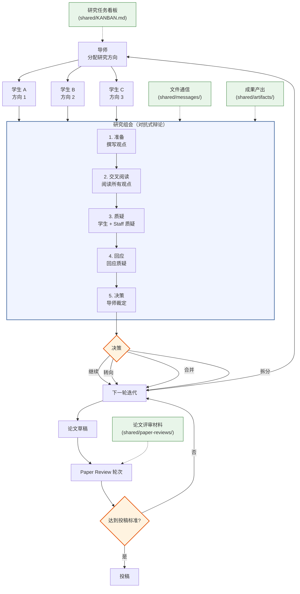

[English](README.md) | [中文](README_CN.md)

<div align="center">

<!-- Logo 占位符 — 有正式 Logo 后替换 -->
<h1>Agora Lab</h1>

**面向 LLM 实验室的 Shell-Native 多智能体研究自动化框架**

对抗式组会、论文评审轮次、可审计的 Markdown 工作流，以及工作区隔离。

`Claude / Codex / Copilot / Gemini · Bash CLI · 导师 / 学生 / Research Staff / Paper Reviewer`

[](LICENSE)


[快速开始](#快速开始) · [教程](docs/tutorial.md) · [示例](examples) · [架构](#系统架构)

</div>

<p align="center">
  
</p>

## 什么是 Agora Lab？

Agora Lab 是一个 shell-native 框架，用于将 supervisor、student、research-staff 和 paper-reviewer 等 LLM 智能体编排成一个可审计的 AI 研究实验室。其核心质量机制是一个双阶段的对抗闭环：结构化研究组会通过辩论不断收敛方向，而专门的 paper-review 轮次则负责把关工作是否达到投稿标准。所有交互都通过 Markdown 文件、共享任务板和各智能体独立工作区流转，使整个研究过程从最初文献调研到最终论文都保持可追踪、可检查。

## 最新动态

- **[2026-04-10]** 开源上线 —— Agora Lab 正式在 GitHub 公开发布

## 系统架构



## 快速上手

```bash
# 1. 安装（一次性，安装到 ~/.agora/）
curl -fsSL https://raw.githubusercontent.com/LiXin97/agora-lab/main/install.sh | bash

# 2. 在任意项目目录中初始化实验室
cd your-project
agora init "Efficient attention mechanisms for long-context LLMs" --students 2 --staff 1 --paper-reviewers 1

# 3. 启动所有智能体 + 看门狗
agora start

# 4. 查看仪表板
agora status
```

这会在你的项目中创建一个 `.agora/` 目录（类似 `git init` 创建 `.git/`）：

```
your-project/
├── .agora/
│   ├── lab.yaml              # 实验室配置（可提交到 git）
│   ├── LAB.md                # 实验室规则（可提交到 git）
│   ├── agents/               # 各智能体工作区（已 gitignore）
│   │   ├── supervisor/
│   │   ├── student-a/
│   │   ├── staff-a/
│   │   └── paper-reviewer-1/
│   ├── shared/               # 共享产物、消息、会议、paper review（已 gitignore）
│   ├── scripts → ~/.agora/scripts  # 指向全局安装的符号链接
│   ├── hooks → ~/.agora/hooks     # 指向全局安装的符号链接
│   ├── templates → ~/.agora/templates  # 指向全局安装的符号链接
│   └── skills → ~/.agora/skills       # 指向全局安装的符号链接
└── .gitignore                # 自动更新
```

也可以使用底层脚本手动搭建同样的实验室：

```bash
AGORA_PROJECT_DIR="$PWD/.agora" bash ~/.agora/scripts/lab-init.sh --topic "Efficient attention mechanisms for long-context LLMs"
AGORA_PROJECT_DIR="$PWD/.agora" bash ~/.agora/scripts/lab-agent.sh -add -name student-a -role student -direction "linear attention"
AGORA_PROJECT_DIR="$PWD/.agora" bash ~/.agora/scripts/lab-agent.sh -add -name student-b -role student -direction "sparse attention"
AGORA_PROJECT_DIR="$PWD/.agora" bash ~/.agora/scripts/lab-agent.sh -add -name staff-a -role research-staff
AGORA_PROJECT_DIR="$PWD/.agora" bash ~/.agora/scripts/lab-agent.sh -add -name paper-reviewer-1 -role paper-reviewer
AGORA_PROJECT_DIR="$PWD/.agora" bash ~/.agora/scripts/lab-agent.sh -init-all
AGORA_PROJECT_DIR="$PWD/.agora" bash ~/.agora/scripts/lab-meeting.sh -caller supervisor -new
AGORA_PROJECT_DIR="$PWD/.agora" bash ~/.agora/scripts/lab-paper-review.sh -new draft-long-context-v1 student-a "paper-reviewer-1"
```

### Docker 快速启动

```bash
docker build -t agora-lab .
docker run -it --rm \
  -e AGORA_COPY_FRAMEWORK=1 \
  -e AGORA_PROJECT_DIR=/workspace/.agora \
  -v "$(pwd):/workspace" \
  -w /workspace \
  agora-lab bash /opt/agora-lab/scripts/lab-init.sh \
    --topic "Efficient attention mechanisms for long-context LLMs" \
    --students 2 --staff 1 --paper-reviewers 1
```

> Docker 镜像仅用于**初始化**宿主机上的 `.agora/` 状态。
> 它会把所需 runtime 文件（`scripts/`、`hooks/`、`templates/`、`skills/`）复制到宿主机项目中，避免生成的实验室依赖容器内路径。
> 如果要让全局安装的 `agora` CLI 使用这份 copied runtime，请显式指定：`AGORA_HOME="$PWD/.agora" agora status`。
> 初始化完成后，请在宿主机上（或单独配置了后端的容器里）运行 agent backend。

> **[完整教程](docs/tutorial.md)** — 从初始化到论文的端到端演练，包含完整的智能体输出示例。
>
> **[示例输出](examples/)** — 浏览研究会话中的样本产物、会议记录和评审报告。

## Agora Lab 对比其他框架

| 能力维度 | Agora Lab | MetaGPT | AutoGen | CrewAI | AI Scientist | Co-Scientist |
|---|:---:|:---:|:---:|:---:|:---:|:---:|
| **对抗式 N x N 评审** | 结构化交叉评审 | -- | -- | -- | 仅自我审查 | Elo 排名 |
| **会议协议** | 五阶段结构化 | -- | 轮询式对话 | -- | -- | 锦标赛制 |
| **研究流水线** | 七步研究循环 + paper-review gate | SOP 驱动的工作流 | 灵活链式调用 | 任务流水线 | 端到端论文生成 | 多步推理 |
| **多后端支持** | Claude / Codex / Copilot / Gemini | 以 OpenAI 为主 | 多模型 | LLM 通用 | OpenAI | Gemini |
| **工作区隔离** | 钩子强制的逐智能体隔离 | 共享内存 | 共享状态 | 共享状态 | 单智能体 | 云端管理 |
| **基于文件的审计追踪** | 完整 Markdown 记录 | 代码文件 | 日志 | 日志 | LaTeX 输出 | 内部系统 |
| **Shell 原生** | 纯 Bash（核心无 Python 依赖） | Python | Python | Python | Python | 云服务 |
| **基于角色的访问控制** | 导师 / 学生 / Research Staff / Paper Reviewer RBAC | 角色分配 | 智能体角色 | 角色委托 | -- | -- |

每个框架都有其优势：MetaGPT 擅长 SOP 驱动的软件工作流；AutoGen 提供灵活的多模态智能体对话；CrewAI 拥有简洁清晰的智能体编排 API；AI Scientist 能自主生成端到端的研究论文；Co-Scientist 使用基于 Elo 的锦标赛排名来筛选想法。Agora Lab 的差异化优势在于**对抗式结构**——研究循环里学生必须经受 staff 的结构化质疑，paper-review 循环则在投稿前再加一道明确的质量闸门，专门检查 novelty、evidence 与 claim discipline。

## 工作流程

```
导师分配研究方向
         |
学生独立探索（tree search）
  |-- 学生 A：方向 1
  |-- 学生 B：方向 2
  +-- 学生 C：方向 3
         |
研究组会（学生 + Research Staff）
  |-- PREPARE    -> 学生撰写观点，Research Staff 撰写判断
  |-- CROSS-READ -> 阅读所有观点
  |-- CHALLENGE  -> 学生交叉质疑 + staff 科学判断
  |-- RESPOND    -> 回应质疑
  +-- DECISION   -> 导师：继续 / 转向 / 合并 / 拆分
         |
下一轮迭代（分支扩展或收敛）
         |
学生产出论文草稿
         |
Paper Review Case
  |-- R1 / R2 / ... 由 Paper Reviewer 执行
  +-- 导师汇总并裁定每一轮
         |
投稿或返修
```

## 角色

| 角色 | 职责 | 后端 + 人设 |
|---|---|---|
| **导师（Supervisor）** | 分配方向、审查进度、主持研究组会、决定何时进入 paper review | 支持任意后端，默认 Claude Code。人设为顶尖 PI / 实验室负责人。 |
| **博士生（PhD Student）** | 独立研究：文献、假设、实验、论文草稿 | 支持任意后端，默认 Claude Code。人设为精英奖学金级别的研究者，具备 MBTI、背景和代表性成果。 |
| **Research Staff** | 参与常规研究组会，审视 scope / evidence / claims，并提供实验室层面的科学判断 | 支持任意后端，默认 Claude Code。人设为资深博后或青年 faculty，擅长指导与评估。 |
| **Paper Reviewer** | 负责独立 paper-review 轮次，重点审查 novelty、rigor、evidence 和 submission readiness | 支持任意后端，默认 Claude Code。人设为顶尖批判性评审专家，具备明确审稿视角和学术成就。 |

## 技能架构

实验室采用分层技能系统：

- **共享参考文档**，对所有角色可用
- **共享核心工作流技能**（研究任务看板、会议、交接）
- **角色特定叠加技能**，针对各角色职责定制

导师、学生、Research Staff 和 Paper Reviewer 的工作区默认加载不同的工作流技能。`lab.yaml` 中生成的角色技能栈是权威来源。

## 核心特性

- **动态扩展**：运行时可添加任意数量的学生、Research Staff 和 Paper Reviewer
- **多运行时**：所有角色均可运行在 Claude Code、Codex、Copilot 或 Gemini 上；Codex/Copilot/Gemini 需显式启用不安全选项
- **人设多样性**：每个智能体具备可见的 MBTI、精英背景、代表性成果和角色特定的研究视角
- **对抗式研究组会**：五阶段协议，结合学生交叉评审与 staff 科学判断
- **独立论文评审闸门**：通过 `lab-paper-review.sh` 在投稿前运行专门的 paper review 轮次
- **丰富的会议上下文**：议程和状态界面在讨论开始前展示参与者的后端信息和人设摘要
- **树搜索**：多个学生同时探索不同方向，导师进行剪枝/合并
- **基于文件的通信**：所有智能体交互通过结构化 Markdown 文件进行
- **研究任务看板**：基于 Markdown 的任务追踪，使用 flock 锁保证并发安全
- **工作区隔离**：钩子机制强制执行逐智能体的工作区边界
- **基于角色的访问控制**：已启动的智能体在研究任务看板和会议操作上绑定运行时身份
- **技能库**：共享的、按角色分类的技能，通过符号链接部署到各智能体
- **会话持久化**：通过逐智能体的 `memory.md` 实现跨会话上下文保存

## 研究组会协议

研究组会是常规研究循环中的核心对抗机制——以真实实验室组会为原型设计：

1. **准备（PREPARE）**：学生在 `perspectives/` 中撰写观点，Research Staff 在 `judgments/` 中撰写判断
2. **交叉阅读（CROSS-READ）**：所有人阅读全部观点，然后通过 `lab-meeting.sh -caller <name> -ack-read` 确认完成
3. **质疑（CHALLENGE）**：学生之间相互评审（N x N），Research Staff 负责从 scope、evidence 和 positioning 角度施加更高层级的科学压力
4. **回应（RESPOND）**：每位参与者回应针对自己工作的质疑
5. **决策（DECISION）**：导师阅读所有材料后做出决策：`CONTINUE`（继续）| `PIVOT`（转向）| `MERGE`（合并）| `SPLIT`（拆分）

Paper Reviewer **不参加**这类常规研究组会；他们通过下面的 paper-review 工作流参与。

## Paper Review 工作流

当学生已经产出值得投稿前审视的论文草稿时，可以开启 paper-review case：

1. **创建 case**：`lab-paper-review.sh -new <paper-id> <owner> <reviewers>`
2. **收集轮次材料**：所有轮次材料保存在 `shared/paper-reviews/<case-id>/rounds/Rn/`
3. **在所有 assigned reviews 到齐后撰写导师裁定**：在 `supervisor-resolution.md` 中总结本轮结论
4. **完成当前轮次**：执行 `lab-paper-review.sh -complete-round <case-id>`
5. 如果仍未达到投稿标准，则使用 `lab-paper-review.sh -round <case-id>` **开启下一轮**

每个 case 都会持久化保存 packet、轮次历史、assigned reviewers 和最终状态。

## 研究流水线

每个学生遵循七步流水线：

1. **文献调研** -> `.agora/shared/artifacts/{name}/literature_{topic}.md`
2. **假设提出** -> `.agora/shared/artifacts/{name}/hypothesis_{id}.md`
3. **实验设计** -> `.agora/shared/artifacts/{name}/experiment_plan_{id}.md`
4. **代码实现** -> `.agora/agents/{name}/workspace/`（私有）
5. **实验执行** -> 在工作区中运行实验
6. **结果分析** -> `.agora/shared/artifacts/{name}/experiment_results_{id}.md`
7. **论文撰写** -> `.agora/shared/artifacts/{name}/paper_draft_{version}.md`

## 命令参考

```bash
# 统一 CLI（推荐）
agora init "topic" [--students N] [--staff N] [--paper-reviewers N]  # 在当前目录初始化实验室
agora start                                         # 启动智能体 + 看门狗
agora stop                                          # 停止所有智能体会话
agora status                                        # 仪表板概览
agora list                                          # 简洁的智能体状态表
agora watch                                         # 实时仪表板（自动刷新）
agora meeting                                       # 交互式运行会议
agora attach <name>                                 # 连接到智能体的 tmux
agora log                                           # 会议历史 + 已完成任务

# 智能体管理（高级）
lab-agent.sh -add -name <n> -role <role> [-backend <cli>] [-model <m>] [-direction "..."]
             [-preset <id>] [-mbti <type>] [-background "..."] [-results "..."]
lab-agent.sh -remove -name <n>
lab-agent.sh -init -name <n>          # 在 tmux 中启动
lab-agent.sh -init-all                # 启动全部
lab-agent.sh -list                    # 列出所有智能体
lab-agent.sh -wake -name <n>          # 恢复崩溃的会话
lab-agent.sh -send -name <n> -from <sender> -message "..."
# 可用角色：supervisor | student | research-staff | paper-reviewer

# 研究任务看板（所有操作需要 -caller <name>）
lab-kanban.sh -caller <name> -new -title "..." -assign <agent> -priority <P0-P3>
lab-kanban.sh -caller <name> -start -id <ID>
lab-kanban.sh -caller <name> -submit -id <ID> -artifacts "path1,path2"
lab-kanban.sh -caller <name> -approve -id <ID>
lab-kanban.sh -caller <name> -reject -id <ID> -reason "..."
lab-kanban.sh -caller <name> -done -id <ID> -summary "..."
lab-kanban.sh -caller <name> -status

# 研究组会（所有操作需要 -caller <name>；仅导师可创建/推进/完成）
lab-meeting.sh -caller supervisor -new       # 创建常规研究循环组会
lab-meeting.sh -caller <name> -phase <name>  # 推进阶段
lab-meeting.sh -caller <name> -ack-read      # 记录交叉阅读完成
lab-meeting.sh -caller <name> -complete      # 标记会议完成
lab-meeting.sh -caller <name> -auto          # 交互式运行所有阶段
lab-meeting.sh -caller <name> -status        # 查看当前会议

# Paper review case
lab-paper-review.sh -new <paper-id> <owner> "paper-reviewer-1 paper-reviewer-2"
lab-paper-review.sh -new paper-001 student-a "paper-reviewer-1"
lab-paper-review.sh -round <case-id>
lab-paper-review.sh -complete-round <case-id>
lab-paper-review.sh -status
```

## 安全模型

Agora Lab 采用分层防御机制实现多智能体隔离：

1. **运行时绑定的调用者身份**：已启动的智能体将其绑定身份导出到 tmux 会话中，`lab-kanban.sh` / `lab-meeting.sh` 会拒绝身份不匹配的调用者
2. **Claude Code 钩子**：`workspace-guard.sh`（PreToolUse）限制写入仅允许角色相关的文件；`kanban-guard.sh`（PostToolUse）验证 `KANBAN.md` 中研究任务看板的格式
3. **权限模式**：`settings.json` 限制每个智能体可访问的 Bash 命令、读/写/编辑路径
4. **安全默认值**：新实验室默认为所有角色选择安全后端，未经 `security.allow_unsafe_backends: true` 显式启用则禁止非沙箱化的 Codex/Copilot 启动

**已知限制**：如果您显式启用了不安全后端，Codex/Copilot 仍作为普通 CLI 进程在 tmux 中启动。它们不受 Claude 的钩子/权限机制约束，因此仅在您接受隔离损失或提供自己的容器沙箱时才启用。

**执行说明**：安全默认的 Claude 学生模板不再允许任意 `python` / `pip` Shell 命令。如需本地实验执行，请使用单独的沙箱化运行器或显式启用不安全后端。

**人设说明**：新智能体在 `lab.yaml` 中持久化 `persona_preset`、`mbti`、`background` 和 `notable_results`。如果旧智能体条目缺少这些字段，状态视图、模板渲染和会议将从 `templates/personas/` 下的角色特定预设目录中派生稳定的默认人设。

## 环境要求

- Bash 4.0+
- tmux
- jq 或 python3（用于安全钩子的 JSON 解析）
- 以下工具中的一个或多个：[Claude Code](https://claude.ai/code)、[Codex CLI](https://github.com/openai/codex)、[Copilot CLI](https://docs.github.com/copilot)、[Gemini CLI](https://github.com/google-gemini/gemini-cli)
- `flock`（Linux 标配，macOS 需 `brew install flock`）

## 参与贡献

欢迎贡献！请在开始之前阅读我们的[贡献指南](CONTRIBUTING.md)和[行为准则](CODE_OF_CONDUCT.md)。

## 社区

- [GitHub Discussions](https://github.com/LiXin97/agora-lab/discussions) — 提问与创意
- [GitHub Issues](https://github.com/LiXin97/agora-lab/issues) — 问题报告与功能请求

## 引用

如果您在研究中使用了 Agora Lab，请引用：

```bibtex
@misc{agoralab2026,
  title={Agora Lab: Adversarial Multi-Agent Research Orchestration},
  author={Agora Lab Contributors},
  year={2026},
  url={https://github.com/LiXin97/agora-lab}
}
```

## 许可证

[Apache 2.0](LICENSE)
