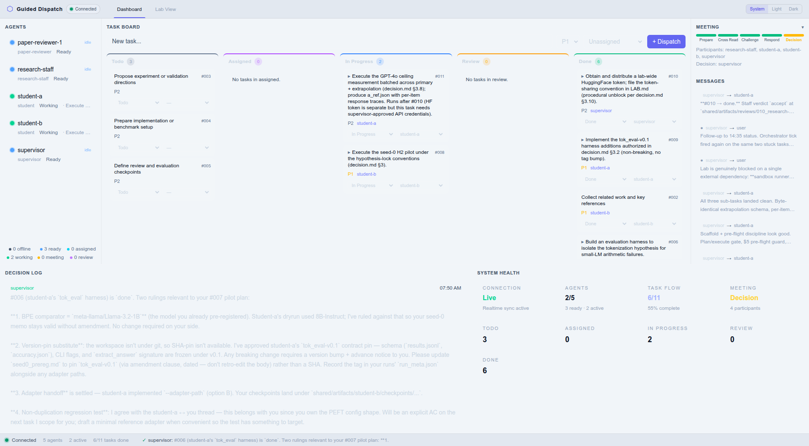
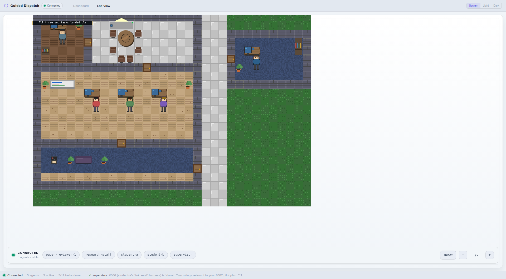

# End-to-End Tutorial: Running Your First Research Session

This tutorial matches the **current TypeScript CLI and web app**. It focuses on the supported command surface today:

- lab initialization
- agent management
- kanban workflow
- meetings
- the dashboard-first web UI

The repository still models `paper-reviewer` as a first-class role, and the `examples/` directory shows the intended paper-review file layout, but dedicated `paper-review` CLI commands are **not yet exposed** in this rewrite.

---

## Prerequisites

- Node.js 18+
- pnpm 8+
- tmux (used by `agora start`)
- At least one AI backend installed: [Claude Code](https://claude.ai/code), [Codex CLI](https://github.com/openai/codex), [Copilot CLI](https://docs.github.com/copilot), or [Gemini CLI](https://github.com/google-gemini/gemini-cli)
- The Agora Lab repository cloned locally

```bash
git clone https://github.com/LiXin97/agora-lab.git
cd agora-lab
pnpm install
pnpm build
```

The examples below assume `agora` is on your `PATH`. If you are running directly from a local clone, replace `agora` with:

```bash
node /path/to/agora-lab/packages/cli/dist/index.js
```

---

## Step 1: Initialize the Lab

Create a new lab inside the project you want to orchestrate:

```bash
cd /path/to/your-project
agora init "Long Context Lab" -t "Efficient attention mechanisms for long-context LLMs"
```

This creates a `.agora/` runtime with:

- `.agora/lab.yaml` and `.agora/LAB.md`
- a default `supervisor`
- `.agora/shared/KANBAN.md`
- directories for `messages/`, `artifacts/`, `meetings/`, and `paper-reviews/`

If you omit the topic, `agora init` falls back to an interactive setup flow.

---

## Step 2: Add Agents

Add the agents you want in this session:

```bash
agora agent add student-a -r student
agora agent add student-b -r student
agora agent add research-staff -r research-staff
agora agent add paper-reviewer -r paper-reviewer
agora agent list
```

The most important role distinction is:

- `research-staff` participates in **regular research meetings**
- `paper-reviewer` is reserved for **submission-readiness review workflows**

---

## Step 3: Start the Lab and Inspect Status

`agora start` does four things when the board is empty:
1. Bootstraps the runtime state file (`.agora/runtime.json`).
2. Seeds a set of starter tasks in `KANBAN.md` — one per research pipeline step — so the board is ready to assign.
3. Launches all configured agents in dedicated tmux sessions.
4. Starts a **runtime watchdog** tmux session that polls messages, KANBAN.md, and meetings, then automatically injects actionable kickoff and dispatch prompts into active agent sessions.

The watchdog runs three injection layers per cycle:

- **Signature-diff (event-driven)**: whenever an agent's unread / assigned-task / meeting state changes, a tailored prompt is sent to its tmux pane.
- **L1 heartbeat (20 min default)**: any agent that has been previously injected but has had no signature change for over the heartbeat window receives a "re-run your Session Start Checklist" ping — this prevents the "no event ⇒ no injection ⇒ permanent idle" deadlock.
- **L2 orchestrator overlay (supervisor only)**: each cycle the runtime aggregates a global view (stuck `in_progress` tasks > 2h, `Review` column empty while `In Progress` is non-empty, stalled meetings, possible blocking chains via `#ID` references). When a real signal exists and the supervisor is otherwise about to be skipped (no pending, or pending whose signature already matches `lastPromptSignature`), an orchestrator prompt is overlaid with an action policy: act on the root blocker, reassign / decompose via `agora kanban`, or write a `shared/messages/supervisor_to_user_*_status.md` note — silent idle is forbidden. Dedup is bucketed in 30-min windows.

Injection is skipped while the target Claude Code TUI is mid-inference (a spinner is detected on the pane), so prompts never stack into paste blocks.

```bash
agora start
agora status
```

`agora status` now reports:

- the current lab name and topic
- each configured agent with its **runtime state**: `offline / ready / assigned / working / meeting / review`
- a kanban rollup with the full task-flow counts: `Todo / Assigned / In Progress / Review / Done`

> **Assignment is the control point.** Agents do not auto-claim tasks after `start`. You (or the supervisor agent) must move a task to `assigned` for an agent to pick it up. This keeps dispatch intentional and auditable.

To tear everything down — agents, the watchdog, and any stale orphan sessions — run:

```bash
agora stop
```

---

## Step 4: Open the Web UI

For day-to-day development, use:

```bash
agora dev
```

This starts:

- the realtime server on the requested port
- a Vite frontend on a second local port

For a built, single-port frontend, use:

```bash
agora web
```

### What you will see

The default UI is a **dashboard-first analyst workbench**:



- **Left:** agent roster and status summary
- **Center:** kanban workbench
- **Right:** recent messages and meeting controls
- **Bottom:** decision log and system health

A **top app chrome** sits above both views and provides:
- lab identity and connection health indicator
- **Dashboard / Lab View** tabs — click to switch the primary surface
- **System / Light / Dark** theme selector

Use the chrome tabs to switch between the dashboard and the pixel-art **Lab View**.

### Lab View controls

**Lab View** is a **low-motion monitoring surface**. Agents reflect their current state (working / meeting / review) but do not animate continuously. It is useful for a spatial at-a-glance overview and for overlay-based inspection:



- `K` or whiteboard: open the kanban overlay
- `M` or meeting table: open the meeting overlay
- click an agent: open the agent sidebar
- drag / scroll: pan and zoom the camera
- toolbar `R`: reset the camera
- `Escape`: close overlays and clear selection

---

## Step 5: Drive the Shared Workflow

You can manage kanban and meetings either from the web UI or from the CLI.

### Kanban

```bash
# Add tasks to the todo queue (unassigned)
agora kanban add -T "Run sparse attention baseline" -p P1
agora kanban add -T "Compare with linear attention" -p P2
agora kanban list
# Dispatch a task to a specific agent (todo → assigned).
# The runtime watchdog will inject a prompt into the agent's tmux session.
agora kanban assign -i 001 -a student-a
# Alternatively, move status manually — assign first, then mark in-progress
agora kanban move -i 001 -s assigned
# Human records that the agent has started work: assigned → in_progress
agora kanban move -i 001 -s in_progress
```

### Meetings

```bash
agora meeting new
agora meeting status
agora meeting advance mtg-...
```

`agora meeting new` automatically includes the currently configured agents and creates a meeting record under `.agora/shared/meetings/`.

Meetings are **manually triggered** — `lab.yaml` sets `meeting.trigger: manual`, so the supervisor calls a meeting only after enough material has accumulated for adversarial debate. Paper reviewers are never valid participants; the server rejects their inclusion and the dashboard picker hides them.

### Dispatching paper reviews

Paper reviewers live outside the regular loop. The supervisor dispatches review tasks with a specific format — a **paper pointer** and a **target conference**:

```bash
agora kanban add -a paper-reviewer-1 -p P2 \
  -T "Review arxiv:2403.12345 | target: NeurIPS 2025 (main track)"

agora kanban add -a paper-reviewer-2 -p P2 \
  -T "Review window=2026-04-01..2026-04-14; topic=\"diffusion language models\" | target: ICLR 2026"
```

The reviewer fetches / searches the paper, loads the target conference's official review form, and writes `shared/paper-reviews/<paperId>/rounds/R1/reviews/<reviewer-name>.md`.

---

## Step 6: Understand the Shared State

The key files and directories inside `.agora/` are:

```text
.agora/
├── lab.yaml
├── LAB.md
├── runtime.json
├── agents/
│   ├── supervisor/
│   ├── student-a/
│   ├── student-b/
│   ├── research-staff/
│   └── paper-reviewer/
└── shared/
    ├── KANBAN.md
    ├── artifacts/
    ├── meetings/
    ├── paper-reviews/
    └── messages/
```

Use this mental model:

1. `runtime.json` — runtime bootstrap state, including whether starter tasks have already been seeded
2. `shared/messages/` — supervisor instructions and agent-to-agent updates
3. `shared/artifacts/` — student outputs and research-staff judgments
4. `shared/meetings/` — regular 5-phase meeting records
5. `shared/paper-reviews/` — reserved space for submission-readiness review rounds

---

## Step 7: Compare Against the Example Snapshot

If you want a concrete reference without running a full session, inspect the curated example in `examples/`:

- `examples/shared/meetings/M001/` — a regular meeting with research-staff judgment
- `examples/shared/paper-reviews/P001/` — an example paper-review packet / round layout

Start with:

```bash
less examples/README.md
```

Then inspect:

```bash
less examples/shared/meetings/M001/agenda.md
less examples/shared/meetings/M001/judgments/research-staff-1.md
less examples/shared/paper-reviews/P001/meta.yaml
less examples/shared/paper-reviews/P001/rounds/R1/reviews/paper-reviewer-1.md
```

---

## Current Scope to Remember

- The TypeScript CLI currently supports **init / agent / start / stop / status / kanban / meeting / web**
- `agora start` seeds starter tasks once (when the board is empty), launches agent tmux sessions, and starts a **runtime watchdog** that auto-injects prompts into active sessions
- `agora stop` tears down every tmux session owned by the lab: agents, the watchdog, and stale orphans
- `agora kanban assign -i <id> -a <agent>` dispatches an existing task to an agent; the watchdog will notify the agent's session
- Role templates are **TS-native Markdown** files loaded by `agora init` and `agora agent add` — each template includes a session-start checklist and current CLI commands (no shell stubs)
- Task lifecycle: `todo → assigned → in_progress → review → done`
- `agora status` reports agent runtime states: `offline / ready / assigned / working / meeting / review`
- The web UI is **dashboard-first** with a top app chrome (tabs + theme selector); **Lab View** is a secondary low-motion monitoring surface accessible via the chrome tab
- `paper-reviewer` remains part of the data model and examples
- The dedicated paper-review command layer has not been surfaced yet in the TypeScript rewrite
